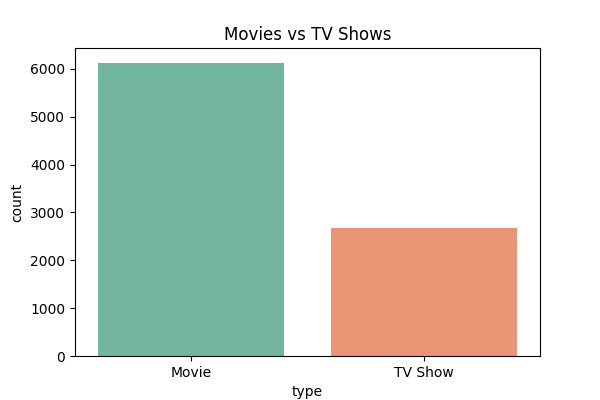
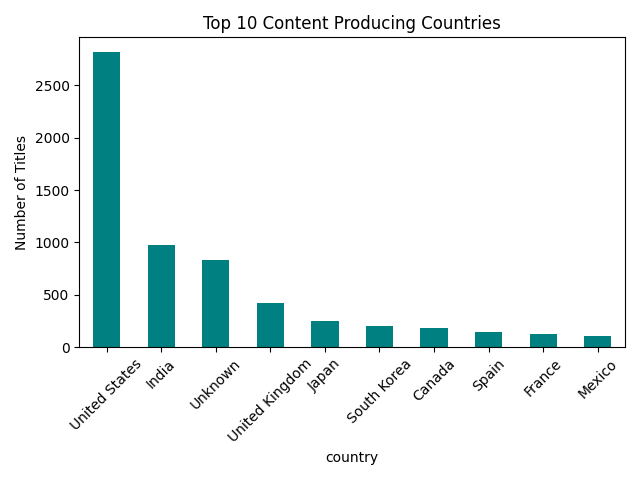
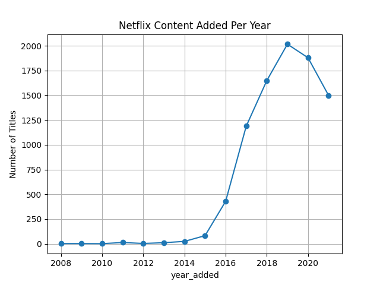
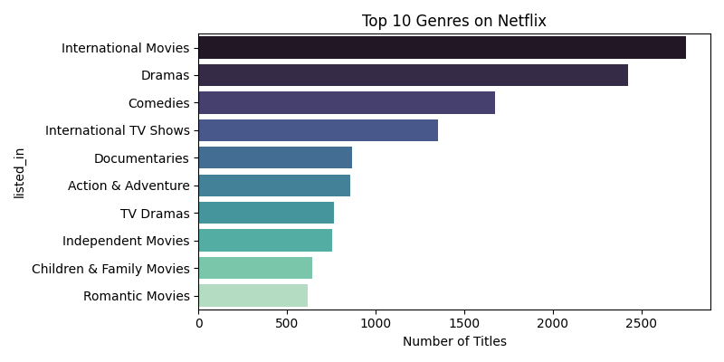

📁 Dataset

    The dataset used is from Kaggle's Netflix Titles Dataset and was loaded directly from a GitHub-hosted CSV file.

📌 Features & Insights

    📺 Distribution of content types (Movies vs TV Shows)
    
    🌍 Top 10 content-producing countries
    
    🎭 Most popular genres
    
    🕒 Trend of content added over the years
    
    🧹 Handles missing values and performs basic data cleaning
    
  🖥️ Technologies Used
  
    Python 3.x
    
    Pandas
    
    Matplotlib
    
    Seaborn

  🧪 How to Run
  Clone the repository:

    git clone https://github.com/your-username/Netflix-Data-Analysis.git
    cd Netflix-Data-Analysis

(Optional) Create and activate a virtual environment:

    python -m venv env
    env\Scripts\activate  # On Windows
    source env/bin/activate  # On macOS/Linux

Install dependencies:
    
    pip install -r requirements.txt
    
Run the script:

    python netflix_analysis.py
    
📦 Dependencies

    pandas
    matplotlib
    seaborn
Or install all using:

    pip install -r requirements.txt

📊 Visual Outputs

    The script will generate and save the following charts:
    
    content_type.png – Movies vs TV Shows
    
    top_countries.png – Top content-producing countries
    
    top_genres.png – Most common genres
    
    content_per_year.png – Content added per year

📌 Sample Output

      Key Insights:
      Total Titles: 8807
      Number of Movies: 6131
      Number of TV Shows: 2676
      Most Common Country: United States
      Most Popular Genre: Dramas

  Screenshots
  

